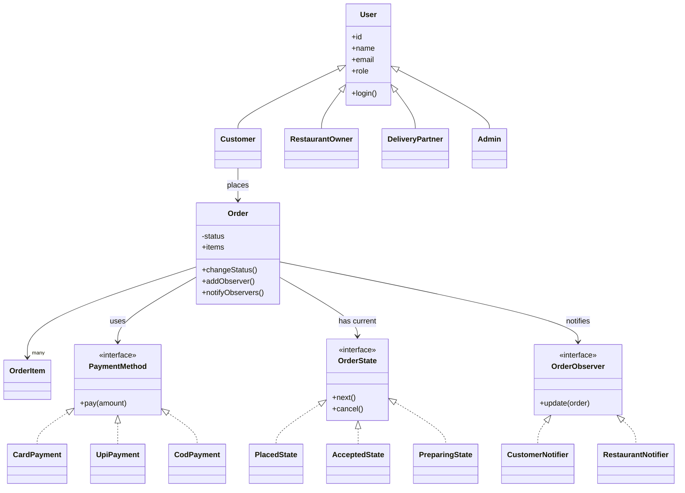

```mermaid
classDiagram
    class User {
        +id
        +name
        +email
        +role
        +login()
    }
    User <|-- Customer
    User <|-- RestaurantOwner
    User <|-- DeliveryPartner
    User <|-- Admin

    class Order {
        -status
        +items
        +changeStatus()
        +addObserver()
        +notifyObservers()
    }
    Customer --> Order : places
    Order --> "many" OrderItem

    class PaymentMethod {
        <<interface>>
        +pay(amount)
    }
    PaymentMethod <|.. CardPayment
    PaymentMethod <|.. UpiPayment
    PaymentMethod <|.. CodPayment
    Order --> PaymentMethod : uses

    class OrderState {
        <<interface>>
        +next()
        +cancel()
    }
    OrderState <|.. PlacedState
    OrderState <|.. AcceptedState
    OrderState <|.. PreparingState
    Order --> OrderState : has current

    class OrderObserver {
        <<interface>>
        +update(order)
    }
    OrderObserver <|.. CustomerNotifier
    OrderObserver <|.. RestaurantNotifier
    Order --> OrderObserver : notifies
```