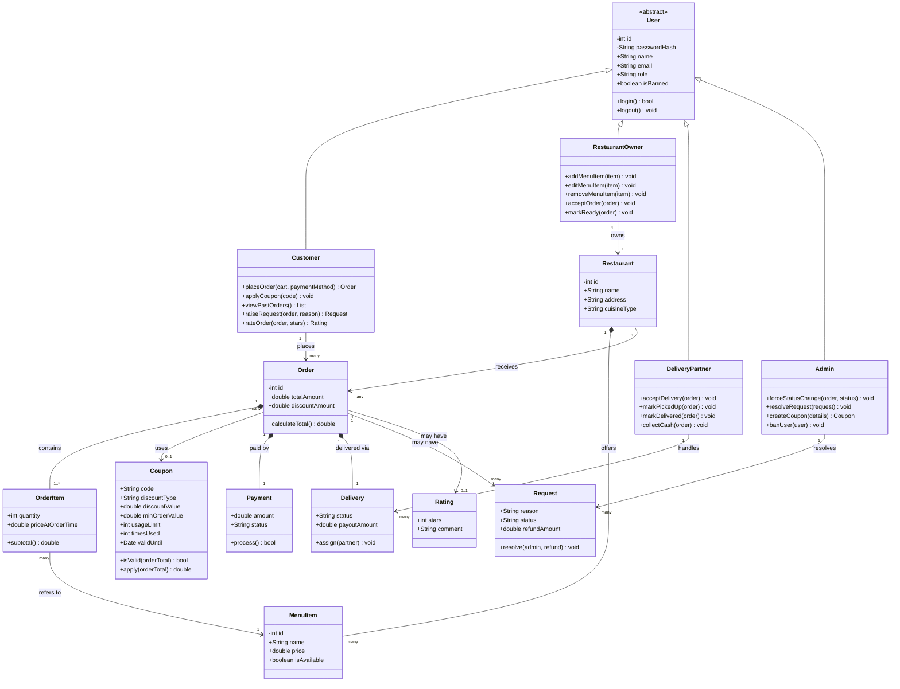
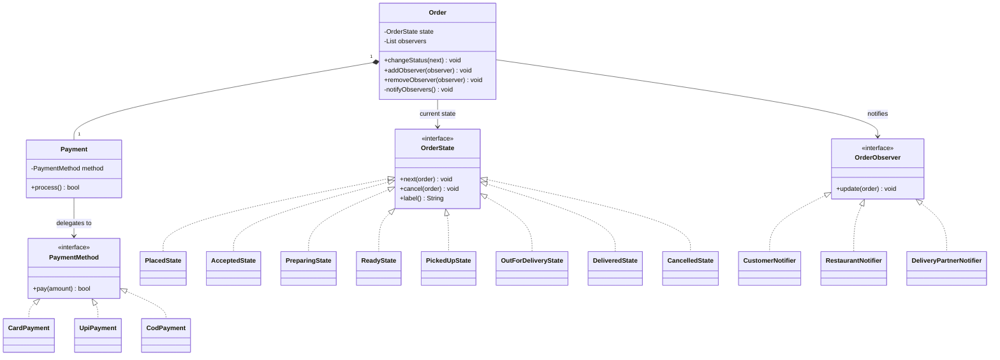

## 1. Domain model

```mermaid
classDiagram
    class User {
        <<abstract>>
        -int id
        -String passwordHash
        +String name
        +String email
        +String role
        +boolean isBanned
        +login() bool
        +logout() void
    }
    class Customer {
        +placeOrder(cart, paymentMethod) Order
        +applyCoupon(code) void
        +viewPastOrders() List
        +raiseRequest(order, reason) Request
        +rateOrder(order, stars) Rating
    }
    class RestaurantOwner {
        +addMenuItem(item) void
        +editMenuItem(item) void
        +removeMenuItem(item) void
        +acceptOrder(order) void
        +markReady(order) void
    }
    class DeliveryPartner {
        +acceptDelivery(order) void
        +markPickedUp(order) void
        +markDelivered(order) void
        +collectCash(order) void
    }
    class Admin {
        +forceStatusChange(order, status) void
        +resolveRequest(request) void
        +createCoupon(details) Coupon
        +banUser(user) void
    }
    class Restaurant {
        -int id
        +String name
        +String address
        +String cuisineType
    }
    class MenuItem {
        -int id
        +String name
        +double price
        +boolean isAvailable
    }
    class Order {
        -int id
        +double totalAmount
        +double discountAmount
        +calculateTotal() double
    }
    class OrderItem {
        +int quantity
        +double priceAtOrderTime
        +subtotal() double
    }
    class Coupon {
        +String code
        +String discountType
        +double discountValue
        +double minOrderValue
        +int usageLimit
        +int timesUsed
        +Date validUntil
        +isValid(orderTotal) bool
        +apply(orderTotal) double
    }
    class Payment {
        +double amount
        +String status
        +process() bool
    }
    class Delivery {
        +String status
        +double payoutAmount
        +assign(partner) void
    }
    class Request {
        +String reason
        +String status
        +double refundAmount
        +resolve(admin, refund) void
    }
    class Rating {
        +int stars
        +String comment
    }

    User <|-- Customer
    User <|-- RestaurantOwner
    User <|-- DeliveryPartner
    User <|-- Admin

    RestaurantOwner "1" --> "1" Restaurant : owns
    Restaurant "1" *-- "many" MenuItem : offers
    Customer "1" --> "many" Order : places
    Restaurant "1" --> "many" Order : receives
    Order "1" *-- "1..*" OrderItem : contains
    OrderItem "many" --> "1" MenuItem : refers to
    Order "many" --> "0..1" Coupon : uses
    Order "1" *-- "1" Payment : paid by
    Order "1" *-- "1" Delivery : delivered via
    DeliveryPartner "1" --> "many" Delivery : handles
    Order "1" --> "many" Request : may have
    Admin "1" --> "many" Request : resolves
    Order "1" --> "0..1" Rating : may have
```

## 2. Design patterns on Order

```mermaid
classDiagram
    class Order {
        -OrderState state
        -List observers
        +changeStatus(next) void
        +addObserver(observer) void
        +removeObserver(observer) void
        -notifyObservers() void
    }

    class Payment {
        -PaymentMethod method
        +process() bool
    }
    class PaymentMethod {
        <<interface>>
        +pay(amount) bool
    }
    class CardPayment
    class UpiPayment
    class CodPayment

    class OrderState {
        <<interface>>
        +next(order) void
        +cancel(order) void
        +label() String
    }
    class PlacedState
    class AcceptedState
    class PreparingState
    class ReadyState
    class PickedUpState
    class OutForDeliveryState
    class DeliveredState
    class CancelledState

    class OrderObserver {
        <<interface>>
        +update(order) void
    }
    class CustomerNotifier
    class RestaurantNotifier
    class DeliveryPartnerNotifier

    Order "1" *-- "1" Payment
    Payment --> PaymentMethod : delegates to
    PaymentMethod <|.. CardPayment
    PaymentMethod <|.. UpiPayment
    PaymentMethod <|.. CodPayment

    Order --> OrderState : current state
    OrderState <|.. PlacedState
    OrderState <|.. AcceptedState
    OrderState <|.. PreparingState
    OrderState <|.. ReadyState
    OrderState <|.. PickedUpState
    OrderState <|.. OutForDeliveryState
    OrderState <|.. DeliveredState
    OrderState <|.. CancelledState

    Order --> OrderObserver : notifies
    OrderObserver <|.. CustomerNotifier
    OrderObserver <|.. RestaurantNotifier
    OrderObserver <|.. DeliveryPartnerNotifier
```